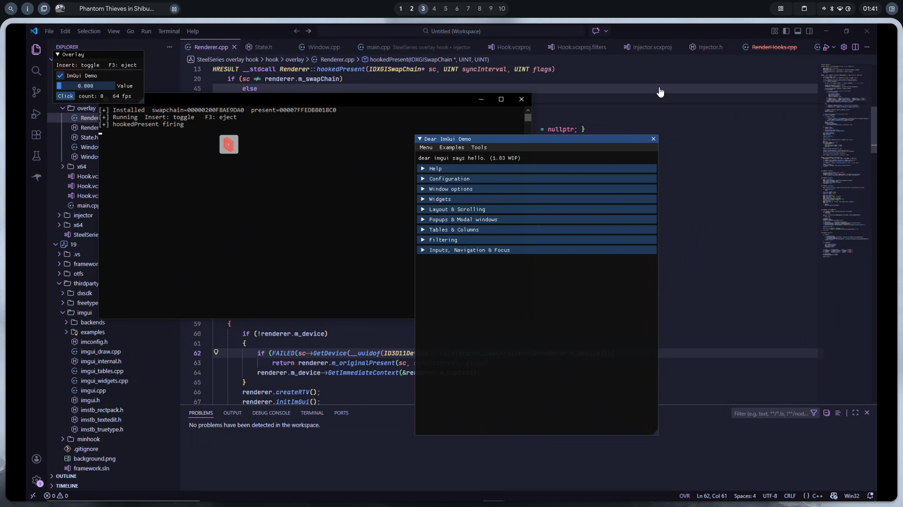
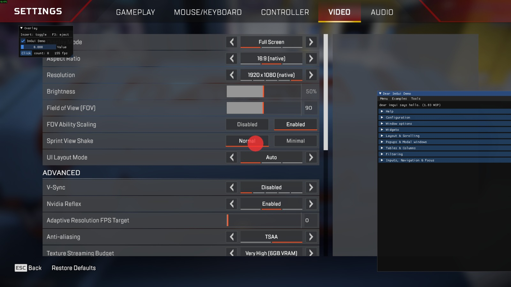

# SteelSeries Overlay Hook



So basically this is an injected DLL that hooks into `SteelSeriesGameOverlay.dll` and lets you draw your own ImGui stuff on top of any game. SteelSeries already has a transparent overlay window running, so we just hijack it. For the injector, there is one included in this repo. It is a simple manual map injector but it works fine since SteelSeries has no injection protection.

---

## What SteelSeries is Actually Doing

### The Window

SteelSeries calls `CreateWindowExW` to make a transparent popup window with the class name `"GameOverlay"`. I found this by searching for `CreateWindowExW` in IDA and following the xref to `Overlay_CreateWindow` at `0x180009620`.

The window has some extended styles baked in: `WS_EX_LAYERED`, `WS_EX_TRANSPARENT`, `WS_EX_NOACTIVATE`, and `WS_EX_TOPMOST`. So by default it is completely click-through and stays on top.

One thing worth noting: the width and height come from fields at `[rdi+68h]` and `[rdi+6Ch]` inside the overlay object. Those are the tracked game window dimensions, not the full monitor size. So the window starts out the same size as the game window.

### The Overlay Object

Every overlay instance has a heap object that holds all its state. You can grab the pointer by calling `GetWindowLongPtrW(hwnd, GWLP_USERDATA)`. Here are the important offsets I reversed in IDA:

```
+0x00   HWND                the overlay window handle
+0x08   HWND                tracked game window (used for foreground checks)
+0x20   IDCompositionDevice*
+0x28   IDXGISwapChain*     the live swapchain (gets recreated on WM_SIZE)
+0x78   BYTE  visibleFlag   1 = window is shown and timer is running
+0x7A   BYTE  fgFlag        1 = game window is in foreground
+0x7B   BYTE  dirtyFlag     1 = force a full render this tick
```

### The Swapchain

Created in `Overlay_InitD3D` at `0x1800085a0`. It is a DirectComposition swapchain with these settings:

```
Format:      DXGI_FORMAT_B8G8R8A8_UNORM
SwapEffect:  DXGI_SWAP_EFFECT_FLIP_SEQUENTIAL
AlphaMode:   DXGI_ALPHA_MODE_PREMULTIPLIED
BufferCount: 2
```

`DXGI_ALPHA_MODE_PREMULTIPLIED` means each pixel's RGB is already multiplied by its alpha. A transparent pixel is just `(0,0,0,0)`. This is how the overlay shows the game underneath it. The backbuffer gets cleared to `(0,0,0,0)` every frame so anything you don't draw is see-through.

### The Render Loop

Found this by tracing `WM_TIMER` in the WndProc at `0x18000a278`. Every timer tick calls `Overlay_RenderFrame` at `0x180009130`. Here is what that function does:

```
1. GetForegroundWindow check (early exit if game is not foreground)
2. IDCompositionDevice::WaitForCommitCompletion()
3. IDCompositionDevice::Commit()
4. IDXGISwapChain::Present(SyncInterval=1, 0)
```

Step 2 is the wild one. `WaitForCommitCompletion` sits and waits for the DWM to finish compositing, which takes about 16ms. Since the whole message loop runs on one thread, every single message has to wait in line behind this call. That is why SS is locked to roughly 60fps no matter what timer rate you set.

### Hiding Logic

`Overlay_UpdateVisibility` at `0x18000a040` runs when the tracked game window loses foreground. It calls `KillTimer(id=1)` to stop the render ticks and then calls `ShowWindow(SW_HIDE)` to make the overlay disappear. We need to intercept both.

---

## How We Hook It

### 1. WndProc Subclassing

We swap out `GWLP_WNDPROC` on the `"GameOverlay"` window using `SetWindowLongPtrA`. Every message goes through our hook first.

Messages we intercept:

| Message | What we do |
|---------|-----------|
| `WM_TIMER` | Eat it. Write `visibleFlag=1`, `fgFlag=1`, `dirtyFlag=0`. Never let `Overlay_RenderFrame` run. |
| `WM_SHOWWINDOW(FALSE)` | Block it. SS tries to hide us when the game loses focus. |
| `WM_WINDOWPOSCHANGING` | Force position to `(0,0)` and size to full screen every time SS tries to resize us. |
| `WM_APP` | Our own one-shot message. Resizes the window to full screen on the SS thread. |
| `WM_NCHITTEST` | Return `HTCLIENT` when menu is open, `HTTRANSPARENT` when it is not. |
| `WM_MOUSEACTIVATE` | Return `MA_ACTIVATE` when menu is open so we can get clicks. |

Eating `WM_TIMER` is the big one. It stops `Overlay_RenderFrame` from ever running so `WaitForCommitCompletion` never blocks the SS thread again.

### 2. Vtable Patching

We grab the swapchain pointer from `overlayObject + 0x28` and overwrite two slots in its COM vtable directly in memory using `VirtualProtect`:

| Slot | Original | Our Replacement |
|------|----------|-----------------|
| 8 | `IDXGISwapChain::Present` | `hookedPresent` |
| 13 | `IDXGISwapChain::ResizeBuffers` | `hookResizeBuffers` |

Any code that calls `Present` or `ResizeBuffers` on this swapchain now hits ours instead.

### 3. Render Thread

We spin up a background `std::thread` that loops and calls `swapchain->Present(0, 0)`. That routes through our hook, which renders ImGui and then calls the original Present. The DWM vsync stall blocks only this thread. The SS message loop runs freely.

---

## Credits


[SteelSeries Overlay Hook](https://www.unknowncheats.me/forum/c-and-c-/719655-steelseries-overlay-hook.html)

[](https://github.com/devirtz)
[](https://discord.com/users/meowdiocre)

--- 

Made by [@devirtz](https://github.com/devirtz)
